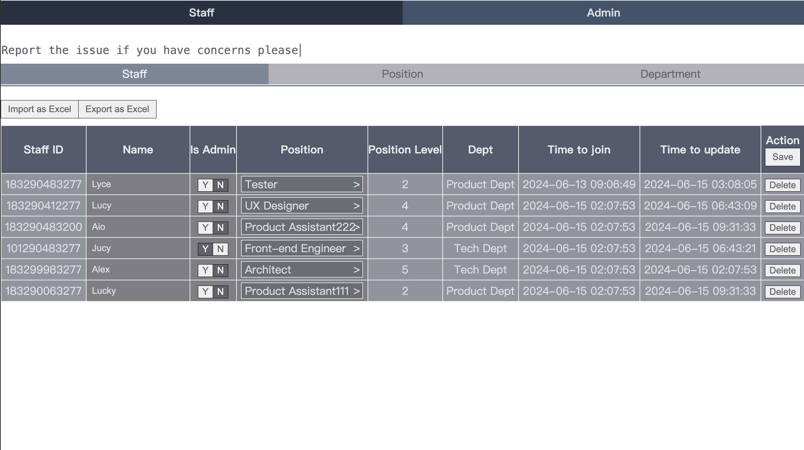
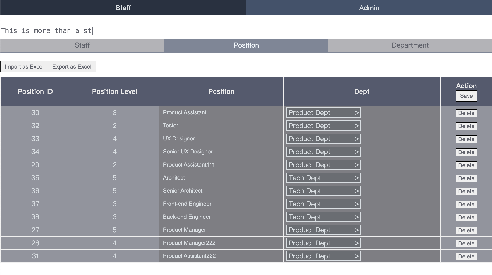
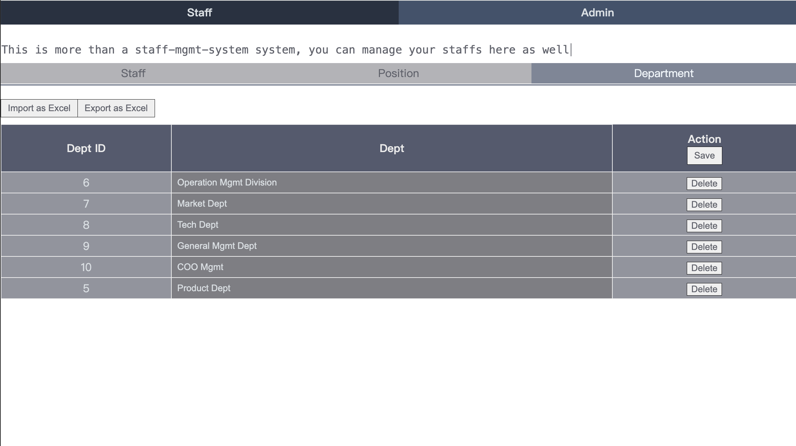
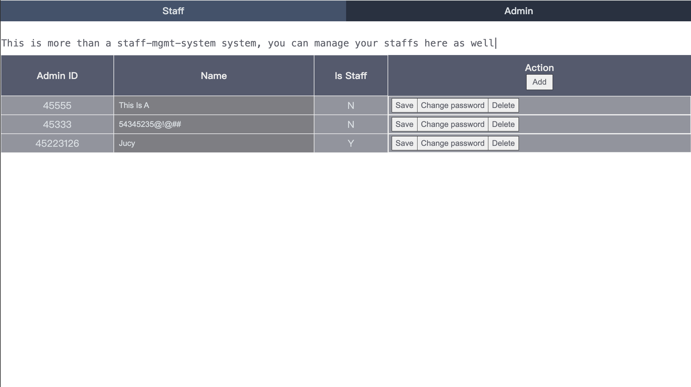

# Staff Management System

This system is a simple human resource management system, you can manage staff,position and department in the company

# System's permission controls
Admin can add/amend/save/delete staff,position and department, they can import multiple data through excel and export excel data, which is very handy for updating multiple insipid data
Staff can only view these infos

# Tech includes

## GUI
| Dependencies         | Version               |
| -------------------- | :-------------------- |
| React                | 18.2.0                |
| Vite                 | ^5.2.0                |
| xlsx                 | ^0.18.5               |

## Server
| Dependencies               | Version               |
| --------------------       | :-------------------- |
| koa                        | ^2.15.0               |
| Vite                       | ^5.2.0                |
| xlsx                       | ^0.18.5               |
| koa                        | ^2.15.0               |
| koa-bodyparser             | ^4.4.1                |
| @koa/router                | ^12.0.1               |
| nodemon                    | ^3.0.2                |
| sequelize                  | ^6.35.2               |
| winston                    | ^3.11.0               |
| winston-daily-rotate-file  | ^4.7.1                |
| pg                         | ^8.12.0               |

Staff

Position

Dept

Admin

